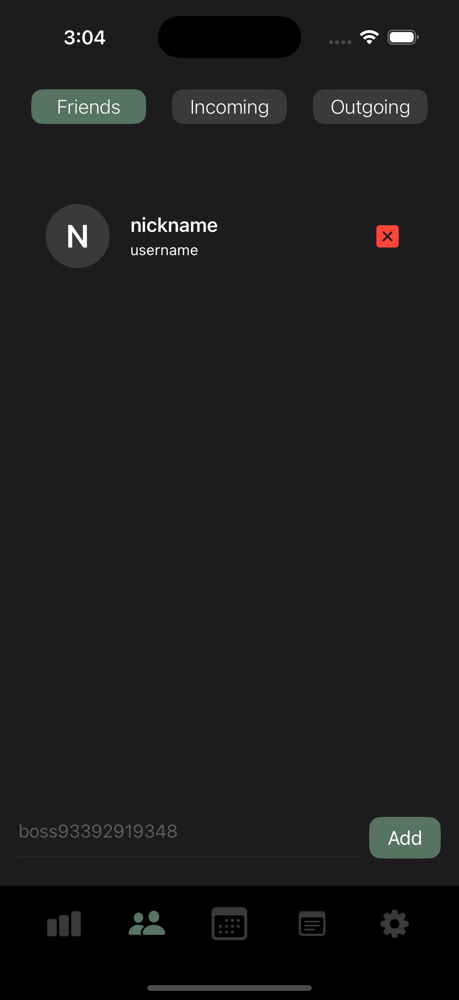
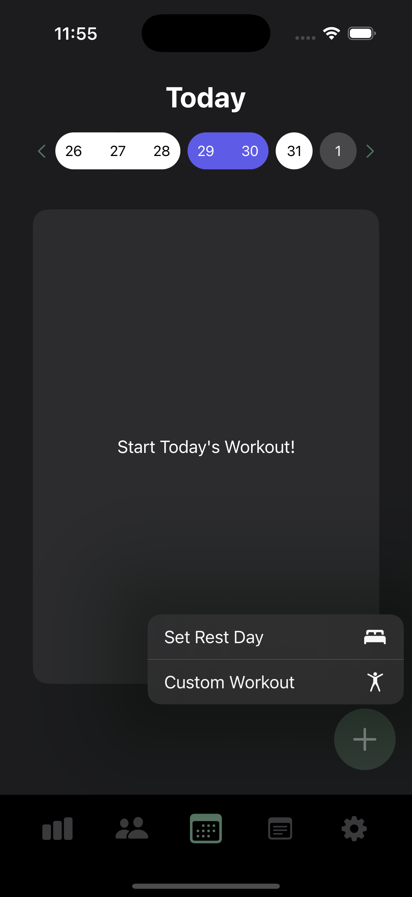

# Osiris Workout Planner

## Overview

(This project is a work in progress)

Osiris is a workout tracking app designed to help users track their exercise routines and build workout plans using AI. The app is built using SwiftUI and integrates with Firebase for authentication and data storage.

## Most Recent

### Mar 4, 2025
   - Small fix to updateIndex in [`ExerciseSliderView`](Osiris/Views/Menu/Tabs/Today/Workout/ExerciseSliderView.swift)
   - working currently
   
## Table of Contents
1. [Features Implemented](#features-implemented)
   1. [Authentication System](#1-authentication-system)
   2. [Realtime Database](#2-cloud-storage)
   3. [Friends and Social](#3-friends-and-social)
   4. [User Interface](#4-user-interface)
2. [To-do](#to-do)
3. [Recent Updates](#recent-updates)
4. [Firebase Rules](#firebase-rules)

## Features Implemented

### 1. **Authentication System**
   - Users can sign up and log in through a simple login or signup screen, powered with Firebase Authentication
   - Authentication state is managed through the [`AuthService`](Osiris/Models/Authentication/AuthService.swift), which tracks the current user session, and current user data.
   - Firebase Auth handles user sessions, including storing and fetching user-specific data securely.
            
<div style="display: flex; justify-content: center; align-items: center;">
       
       
</div>

### 2. **Cloud Storage**
   - All online pushes and pulls are handled with [`CloudService`](Osiris/Models/CloudService.swift)
   - Authentication is also done using [`CloudService`](Osiris/Models/CloudService.swift)
   - Firebase is used to store and sync data, including workout logs in [`LogService`](Osiris/Models/Logging/LogService.swift).
   - [`ProfileService`](Osiris/Models/User/ProfileService.swift) safely handles user connections, like friends, requests, blocked users, etc. 
   - Workout plans and logs are stored in separate database collections, allowing users to share workout plans without compromising their own data.
   
### 3. **Friends and Social**
   - [`ProfileService`](Osiris/Models/User/ProfileService.swift) handles friends, pending requests, and blocked users while ensuring local data is synchronized with the cloud.
   - `SocialView` (in-progress) will display friends, pending outgoing and incoming requests, and blocked users and allow the user to add new friends by entering their username.
   
<div style="display: flex; justify-content: center; align-items: center;">
    
</div>
   
### 4. **User Interface**
   - Created an interactive login/signup screen using SwiftUI animations, in [`AuthView`](Osiris/Views/Authentication/AuthView.swift) 
   - Created a [`TodayView`](Osiris/Views/Menu/Tabs/Today/TodayView.swift) page which shows statuses for each day in the current week. It also gives an overview of previous workouts for the selected day and allows users to start a new workout.

<div style="display: flex; justify-content: center; align-items: center;">
    
    
</div>


## To Do

### 1. **AI Exercise Recommendation System**
   - Create my own model based on CoreML or use an API with OpenAI or Google's Gemini that can do the following:
   - New users can provide information regarding what equipment they have access to, their goals, and other factors. Then, exercises are filtered by some of those factors, while the more open-ended factors are processed through a RAG model. A workout plan is created and shared with the user. If the user is not satisfied with an exercise, they can replace them manually, or automatically with a prompt:
   - Users can replace exercises with alternative exercises based on their issues. eg: User struggles doing Bodyweight Dips, the app could recommend Close Grip Bench Press, an exercise that is easier to learn (lower rating), but still strengthens the same or similar muscle groups. 
    
### 2. **Achievements**
   - Users can collect achievements through logging workouts, adding friends, hitting certain muscle groups, etc.

### 3. **Friends and Social**
   - Users can add friends through their usernames, and see their saved workouts, previous workouts, and achievements.
   - Users can compete with friends to reach a goal. Eg: first to bench 225 (Maybe on this one)

### 4. **Strength Level Ranking**
   - I aim to work with strengthlevel.com to allow users to see where they stand among other lifters.
   - If this is not possible, I can create my own dataset using statistics online regarding lifts, as well as user data.

## Recent Updates

### Feb 21-22, 2025
   - Took a break to work on a new project (Carp) will split my time between the two projects.
   - Modularized some components from [`WorkoutStartView`](Osiris/Views/Menu/Tabs/Today/Workout/WorkoutStartView.swift) and created [`ExerciseSliderView`](Osiris/Views/Menu/Tabs/Today/Workout/ExerciseSliderView.swift) specifically for swiping between exercise entries.
   - For [`ExerciseSliderView`](Osiris/Views/Menu/Tabs/Today/Workout/ExerciseSliderView.swift), I used `GeometryReader` to track the dragging gesture. This way the user can slide in between exercise cards freely and intuitively.
   - I also utilized a HStack rather than a ZStack so that scrolling is possible.
   - Fixed issues with alignment in InputView
   - Planning on adding options to adjusting set types (eccentric, isometric), as well as differentiating between warmup vs working sets.
   - Done with animation

### Feb 3, 2025
   - Created [`WorkoutService`] so that functions regarding `currentWorkout` can be run without worrying about a fatal error.
   - Worked more on exercise tabs to [`WorkoutStartView`](Osiris/Views/Menu/Tabs/Today/Workout/WorkoutStartView.swift) that have data on each set and a few other UI components
   - Plans: I plan to finish [`WorkoutStartView`](Osiris/Views/Menu/Tabs/Today/Workout/WorkoutStartView.swift) and move on to [`WorkoutEndView`](Osiris/Views/Menu/Tabs/Today/Workout/WorkoutEndView.swift)] so that it can be pushed to a log and onto Firebase.

### Feb 2, 2025
   - Worked on making the UI for [`WorkoutStartView`](Osiris/Views/Menu/Tabs/Today/Workout/WorkoutStartView.swift)
   - Minor tweaks in [`WeekView`](Osiris/Views/Menu/Tabs/Today/WeekView.swift)
   - Many changes in [`LocalService`](Osiris/Models/LocalService) for better compatibility with [`WorkoutStartView`](Osiris/Views/Menu/Tabs/Today/Workout/WorkoutStartView.swift)
   - [`WorkoutStartView`](Osiris/Views/Menu/Tabs/Today/Workout/WorkoutStartView.swift) is in progress but I mainly worked on animation for entry tabs which is complete.
   - Plans: I plan to finish [`WorkoutStartView`](Osiris/Views/Menu/Tabs/Today/Workout/WorkoutStartView.swift) by the end of Feb 3. After which I will be adding some more exercises and experimenting with a visual component displaying the `musclesTargeted` of exercises.

### Feb 1, 2025
   - Added a new parameter `showView2` to [`SlideViews`](Osiris/Models/Animation/SlideViews.swift), allowing a streamlined way of animating two views without manually inverting a bool binding.
   - Days of the week with matching statuses are now connected visually in [`WeekView`](Osiris/Views/Menu/Tabs/Today/WeekView.swift).
   - Created [`ExerciseService`](Osiris/Models/Logging/ExerciseService.swift) which is designed to read json files containing exercises following the class [`Exercise`](Osiris/Models/Logging/Static/Exercise.swift).
   - Worked on making [`WeekView`](Osiris/Views/Menu/Tabs/Today/WeekView.swift) just overall more visually appealing and scalable.

### Jan 31, 2025
   - Created counterparts for `WorkoutEntry` and `ExerciseEntry` that use composition to store temporary data, like `nextOrder` which dictates the index of the next exercise or set.
   - Created [`SlideViews`](Osiris/Models/Animation/SlideViews.swift) which takes 2 views and animates them when a binding is changed.
   - [`WorkoutView`](Osiris/Views/Menu/Tabs/Today/Workout/WorkoutView.swift) is be animated with [`WeekView`](Osiris/Views/Menu/Tabs/Today/WeekView.swift), while still being able to animate newly created views, [`WorkoutStartView`](Osiris/Views/Menu/Tabs/Today/Workout/WorkoutStartView.swift) and [`WorkoutEndView`](Osiris/Views/Menu/Tabs/Today/Workout/WorkoutEndView.swift). 
   - [`WeekView`](Osiris/Views/Menu/Tabs/Today/WeekView.swift) now has an option to start a workout. It also lists the user's workout plans, but there is no way to add or create plans yet.

### Jan 23-30, 2025
   - Fixed `changes` in [`ProfileService`](Osiris/Models/User/ProfileService.swift) so that it uses a queue rather than a list, allowing for changes to be pushed asynchronously.
   - Fixed an issue where `connections` in [`ProfileService`](Osiris/Models/User/ProfileService.swift) would fail upon attempt of removal of a connection.
   - Fixed add and remove buttons in [`SocialView`](Osiris/Views/Menu/Tabs/Social/SocialView.swift) and [`ProfileCard`](Osiris/Views/Menu/Tabs/Social/ProfileCard.swift)

### Jan 17-18, 2025
   - Changed 2024 -> 2025 in a lot of my entries
   - Updated [Firebase Rules](#firebase-rules)
   - Fixed add and remove button UI in [`SocialView`](Osiris/Views/Menu/Social/SocialView.swift)
   - Found a problem in [`ProfileService`](Osiris/Models/User/ProfileService.swift) which doesnt push changes correctly due to an error in removing the latest change

### Jan 15-16, 2025
   - Fixed a bug that causes log and profile data to be retained after signing out.
   - Fixed a bug that pushes a connection with `currentProfile.id` rather than the other profile's `id`
   - To fix this I added two new functions `updateConnectionWithSelf()` and `removeConnectionWithSelf()`. Now adding friends works as intended.
   - Still working on accepting and declining incoming requests as well as removing outgoing requests.
   - Fixed a bug that allowed creation of accounts with duplicate usernames
   - Fixed a bug that didn't update the error message in [`LoginView`](Osiris/Views/Authentication/LoginView.swift) and [`RegistrationView`](Osiris/Views/Authentication/RegistrationView.swift)
   - Added `socialErrorMessage` which is managed by [`ProfileService`](Osiris/Models/User/ProfileService.swift) and displayed on [`SocialView`](Osiris/Views/Menu/Tabs/Social/SocialView.swift)

### Jan 14, 2025
   - Added [`SocialView`](Osiris/Views/Menu/Tabs/Social/SocialView.swift) and created most of the UI. Still need to add error messages and fix some [`ProfileService`](Osiris/Models/Planning/PlanService.swift) calls.
   - Created [`ProfileCard`](Osiris/Views/Menu/Tabs/Social/ProfileCard.swift) to display profiles and buttons to change the connection status with that profile.
   - Fixed [`SettingsView`](Osiris/Views/Menu/Tabs/Settings/SettingsView.swift) issues with unmatching colors in List component.
   - Current bugs: can't add friends by username as of yet. Still figuring out why. Also trying to figure out embedded button UI for the profiles, so that pressing the whole profile card will load more details, but pressing the X or Checkmark button will change connection status.
   - Plans: I plan to add trophies into SocialView, but for right now I'll leave it as be.
   - I will start back on workout logging and plans after I complete this.

### Jan 14, 2025
   - [`ProfileService`](Osiris/Models/User/ProfileService.swift) now maintains synchronization of connection statuses between users.
   - [`Profile`](Osiris/Models/User/Profile.swift) was created and added to collection `profiles` so that some user data can be kept private. These changes are reflected in [`ProfileService`](Osiris/Models/User/ProfileService.swift)
   - Added method `queueChange(username: String, change: Change)` to [`ProfileService`](Osiris/Models/User/ProfileService.swift)
   - Have already drawn out a SocialView to recreate in Swift! 
   - I took a break from workout logging as I ran into an issue but I'll revisit that after I'm done with socials.

### Jan 13, 2025
   - [`ProfileService`](Osiris/Models/User/ProfileService.swift) handles connection changes and updates locally only if Firestore changes are successful.
   - [`ProfileService`](Osiris/Models/User/ProfileService.swift) was created to manage user connections and handle changes to connection requests.
   - The method `pushChanges()` was created to ensure local changes reflect changes on the cloud
   - `parseConnections()` initializes user connections, adding them to relevant categories to be displayed on SocialView (incomplete atm) (friends, inbound, outbound, blocked).

### Jan 12, 2025
   - Still figuring out local data
   - Changed [CloudService](Osiris/Models/CloudService.swift) to include authentication
   - Deprecated AuthService

### Jan 11, 2025
   - Trying to figure out how I want to store local data and when I want to push it to the cloud.

Goals for now:
   - Fix TodayView
   - Add social page
   - Allow viewing of logs with StatsView

### Jan 9-10, 2025
   - [PlanService](Osiris/Models/Planning/PlanService.swift) was created to track workout plans
   - [LocalData](Osiris/Models/LocalData.swift) was created to store local data (like in progress workout entries) before they are pushed using [CloudService](Osiris/Models/CloudService.swift)
   - [WeekView](Osiris/Views/Menu/Tabs/Today/WeekView.swift) was added to control animations between [TodayView](Osiris/Views/Menu/Tabs/Today/TodayView.swift) and [WorkoutView](Osiris/Views/Menu/Tabs/Today/WorkoutView.swift)
   - [Animations](Osiris/Models/Animation/Animations) is a work-in-progress struct with functions that aims to allow modularity in views with similar animations.

### Jan 7, 2025
   - Created [`AuthView`](Osiris/Views/Authentication/AuthView.swift) -> animates [`LoginView`](Osiris/Views/Authentication/LoginView.swift) and [`RegistrationView`](Osiris/Views/Authentication/RegistrationView.swift) smoothly, only rendering what's on screen.
   - [`ControllerView`](Osiris/Views/ControllerView.swift) -> implements [`AuthView`](Osiris/Views/Authentication/AuthView.swift)
   - [`LoginView`](Osiris/Views/Authentication/LoginView.swift) + [`RegistrationView`](Osiris/Views/Authentication/RegistrationView.swift) -> moved logo component to [`AuthView`](Osiris/Views/Authentication/AuthView.swift)

### Jan 4-6, 2025
   - `CloudService` -> main access to Firebase
   - `AuthService` -> originally `AuthViewModel`, now only includes methods related to the `user` collection
   - `LogService` -> originally a part of `AuthViewModel`, now solely contains methods related to the `logs` collection
   - `TodayView` -> Implemented a modular menu that can be used to set workout plans and rest day statuses.
   - `LaunchView` -> Added a launch screen and animated the loading screen
   - `ExerciseStats` -> Created a class to hold individual exercise stats for users.

### Dec 31, 2024
   - `AuthViewModel` -> removed all methods for `streaks`, replaced them with methods for `restDays`
   - `Log` -> removed the property `streaks`, instead opting for `restDays` of type `[Date]`
   - `TodayView` -> changed a few function calls for streaks
   - Plans: I plan to use either hashing or firebase's built in querying to make locating specific entries or dates simpler. My next step will be to implement a pop up view for workout plans, as well as adding a global collection of workout plans, so that they can be shared with others and used by multiple people.

### Dec 30, 2024
   - `AuthViewModel` -> attempted to update streaks in log, but failed
   - `Log` -> created new property of `Log`, `streaks`, of type `[Date:StreakStatus]`
   - `AuthViewModel` -> added new property of `AuthViewModel`, `authErrorMessage`, which is updated in `fetchUser()`
   - `LoginView` -> successfully implemented `authErrorMessage` into the UI
   - `RegistrationView` -> ditto
   - `TodayView` -> added temporary buttons to test using `AuthViewModel`, more specifically `updateStreak()` and `getWeekStatuses()`
   - Plans: I plan to remove `streaks` and instead change `WorkoutEntry` to use optional types and store a status. Only 2 statuses should be stored, `.skipped` and `.completed`, the other 2 can be inferred by the program and do not need to be stored. I also plan to implement a pop up view on `TodayView` soon that allows the user to select a workout plan or rest day for the selected date.

### Dec 29, 2024
   - `WorkoutEntry` -> removed DateEntry structure, opted for a separate dictionary keeping track of streaks
   - `AuthViewModel` -> added functions to add and update log and properties of log
   - `TodayView` -> attempted to create weekly view (not perfectly functioning)
   - `LoginView` -> button becomes fully opaque when fields are correctly filled
   - `RegistrationView` -> ditto
   - `Log`
   - `ContentView`
   - `User`
   
### Dec 28th and prior
   - look at commits i didnt write this down

## Firebase Rules
Since I'm not planning on releasing this on the app store, I decided to provide my firebase rules:

```
rules_version = '2';

service cloud.firestore {
  match /databases/{database}/documents {
    // "users" collection
    match /users/{userId} {
      // only allows
      allow read, write: if request.auth != null && request.auth.uid == userId;
    }

    // Match the "profile" collection (public data)
    match /profiles/{profileId} {
      // everyone can read (will change later to connections only)
      allow read: if true;
      
      // only owner of profile can write
      allow write: if request.auth != null && 
      profileId == get(/databases/$(database)/documents/users/$(request.auth.uid)).profileId;
    }
    
    // "profiles" -> "connections" subcollection
    match /profiles/{profileId}/connections/{connectionId} {
      // anyone can read or write to the connections subcollection
      allow read, write: if true;
    }

    // Match the "log" collection (public data)
    match /logs/{logId} {
      // everyone can read (for now)
      allow read: if true;

      // only owner of log can write
      allow write: if request.auth != null &&
      logId == get(/databases/$(database)/documents/users/$(request.auth.uid)).logId;
    }
      
    // TESTING RULES
    // match /{document=**} {
    //   allow read, write: if request.time < timestamp.date(2025, 1, 22);
    // }
  }
}
```
